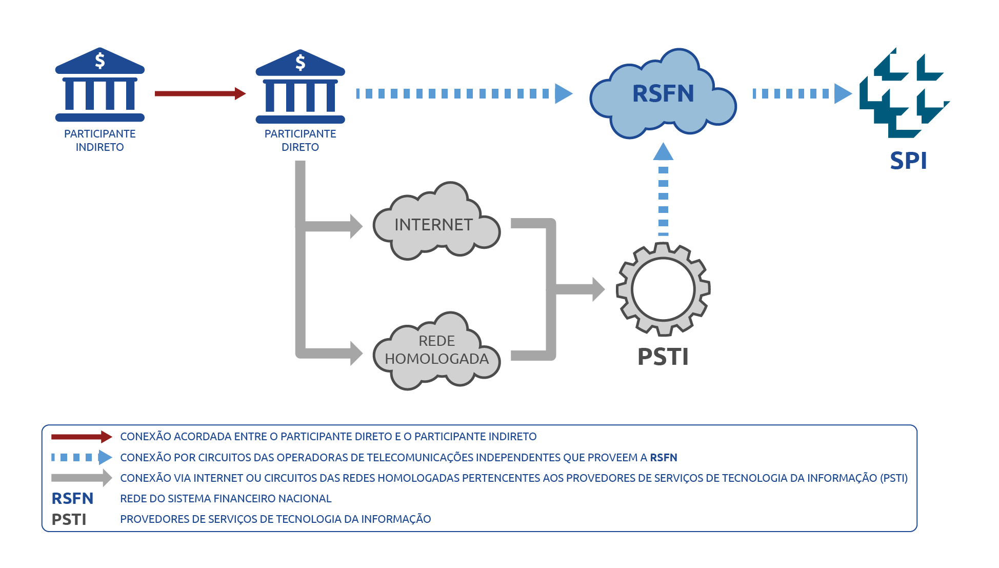
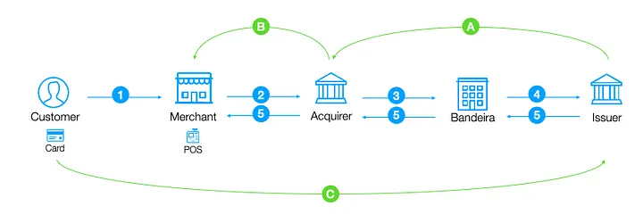

# Pix Credit - Request For Comment (RFC)

This document proposes an approach on implementing credit transactions based on pix.

## Motivation

Pix can be a building-block for more complex implementations. Pix API is open-sourced by Banco Central do Brasil (BACEN). This allows companies to use it for developing new products on top of it. This RFC proposes Pix Credit, credit built on top of pix. 

## Definitions

### What's pix?

Pix[^1] is an inovative instant payment method created and patented by BACEN. As far as noticed no other country have a similar implementation. All it takes to work is someone with an active bank account and internet. 

#### Basic Working Flow

Pix itself only transfers money from account A to account B (in seconds). Besides other features is has, that's all it does in summary. 

Pix transactions have no fees. For instance when person A pays a charge from person B, none of them pay any fees. Person B pays no fee for generating charges and person A pays no fee during payment. 

### What's credit?

Credit[^2] is a money borrowing mechanism where people buy and pay later. The most known method for credit access is a credit card. All it takes to work is a bank account and credit available for use. 

#### Basic Working Flow 

Every transaction uses available debit from the credit balance. For instance customer A can spend BRL 1.500 (one thousand fivehundred reais) when BRL 3.000 (three thousand reais) is available as credit. And fees are charged from customer A if the credit card bill becomes past due. 

## Architecture

### Pix 

Pix is handled by BACEN infrastructure through "Sistema de Pagamentos Instantâneos (SPI)"[^3]. And I quote: 

>O Sistema de Pagamentos Instantâneos (SPI) é a infraestrutura centralizada e única para liquidação de pagamentos instantâneos entre instituições distintas no Brasil.
>
>O SPI é um sistema que faz liquidação bruta em tempo real (LBTR), ou seja, que processa e liquida transação por transação. Uma vez liquidadas, as transações são irrevogáveis.
>
>Os pagamentos instantâneos são liquidados com lançamentos nas contas de propósito específico que as instituições participantes diretos do sistema mantêm no BCB, denominadas Contas Pagamento Instantâneo (Contas PI). Para garantir a solidez do sistema, não há possibilidade de lançamentos a descoberto, isso é, não se admite saldo negativo nas Contas PI.

#### Accessing SPI

Image source: BACEN[^4]
 
### Credit Card

Credit card payment proccessing is defined as a "Payment Arrangement" meaning that several players participate in this process. As consequence many different infrastructures are chained up to the point where merchants are paid and customers get their final bill.[^5] I quote: 

>Um arranjo de pagamento é um conjunto de regras e procedimentos que disciplina a prestação de determinado serviço de pagamento ao público. Diferentemente da compra com dinheiro vivo entre duas pessoas que se conhecem, o arranjo conecta todas as pessoas que a ele aderem. É o que acontece quando o cliente usa uma bandeira de cartão de crédito numa compra que só é possível porque o vendedor aceita receber daquela bandeira.

#### Accessing Credit

Image source: Lucas Rosa[^5]

**
Subtitle
**

| Role       | Function                                                                                                         |
|------------|------------------------------------------------------------------------------------------------------------------|
| Customer   | Is a cardholder, someone who owns the credit card.                                                               |
| Merchant   | Store who seels a service or product.                                                                            |
| Acquirer   | Institution that brigdes merchants and card brands. Providers of credit card machines used in POS for instance. Just to mention a few Cielo, Stone and SumUp.                                                             |
| Card Brand | They're responsible for bridging customers, acquirers and issuers. The most famous ones are Visa and Mastercard. |
| Issuer     | Finantial institution responsible for paying acquirers and collecting money from customers.                      |
| POS        | Point Of Sale, device that merchants use to charge their clients.                                                |

## Pix Credit

Pix Credit combines the agility of payment from pix with the easiness of borrowing money through credit. 

### Basic Working Flow

Let's imagine a Marchant adopted Pix Credit (PC) in their Point Of Sale (POS). Thus as expected a customer makes a purchase using PC balance available in his/her account. 

1. A Pix charge is generate in Woovi's platform from the **Merchant** side
2. The **Customer** opens his/her Pix Credit Section provided by the **Issuer**
3. This Pix Charge is paid by the **Customer**
4. The amount for this purchase is charged from Pix Credit **Customer** balance
5. **Merchant** cashes in sales amount
6. For the next purchase, all steps above may be repeated untill no balance if left in **Customer**'s Pix Credit balance 

## Business Rules

Next, all the steps above are dissected in context of business rules. 

### 1. Charge Generation

In essence there are **three sources of revenue**[^6] for Pix Credit: 

1. Interest from Monthly bill (**Customer**)
2. Fees from past due bills or cash advance (**Customer**)
3. Interchange also known as transaction fees (**Merchant**)

Considering the charge generation mentioned before, one fee is applied **(Interchange)**:  The **Merchant** pays up to **8%** from total sold. For a sale of **$3.000,00 (three thousand)** up to **$240** is charged from  him/her. 

### 2. Customer Pix Credit Access

In this step the **Customer** needs a mean to pay his debt. So his/her banking app transactions the available balance. There are two possible situations: 

1. Customer **has balance available** so this money is debited
2. Customer **uses Pix Credit balance** thus borrowing money from his **Issuer**. Later on this pending payment becomes a Pix Credit Bill

Now, back to the basic working flow...this money is withdraw from option 1.

[ ] - Explain how we make money from transactions (maybe add an image here as well)

[ ] - Explain how credit is approved/rejected (maybe add an image here as well)

[ ] - Explain how/when money is taken by woovi (maybe add an image here as well)

[ ] - Explain pix credit risks for bank and customers (maybe add an image here as well)

### How we make money

### Basic Work Flow

[ ] - Explain how a charge is generated, how fees are calculated and when they're charged (maybe add an image here as well)

### Use Cases

[ ] - Initially create one use case (maybe add an image here as well)

[^1]:https://www.bcb.gov.br/en/financialstability/pix_en
[^2]:https://www.experian.com/blogs/ask-experian/credit-education/faqs/what-is-credit/
[^3]:https://www.bcb.gov.br/estabilidadefinanceira/sistemapagamentosinstantaneos
[^4]:https://www.bcb.gov.br/content/estabilidadefinanceira/SPI_IMG/info_sistema_pagamentos_instantaneos_acesso%20ao%20SPI_br_0170_2020.png
[^5]:https://lucascmrosa.medium.com/sistemas-de-pagamentos-i-cart%C3%B5es-53ece499f9e3
[^6]:https://www.nerdwallet.com/article/credit-cards/credit-card-companies-money